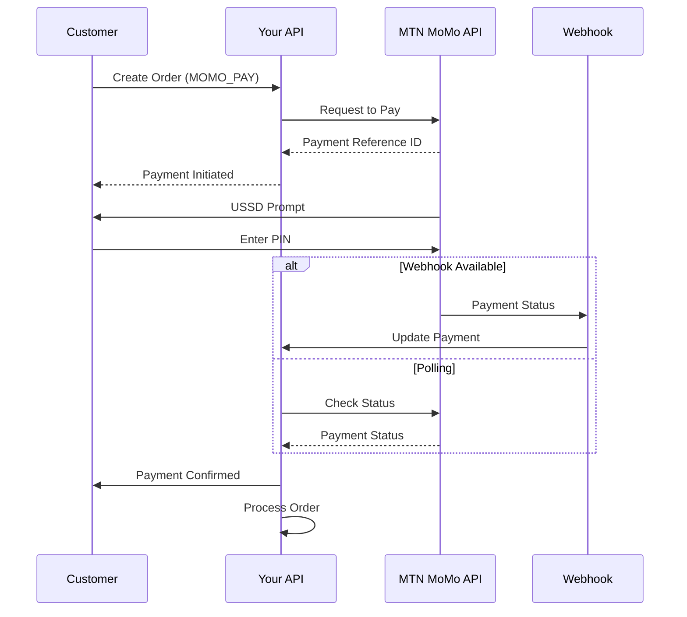

# MTN Mobile Money Integration Guide

This guide provides step-by-step instructions for setting up and using the MTN Mobile Money (MoMo) payment integration in your food delivery platform.

## 🚀 Quick Start

### 1. Prerequisites

- MTN MoMo Developer Account
- Node.js 18+ and npm/yarn
- PostgreSQL database
- Basic understanding of REST APIs

### 2. MTN MoMo Developer Setup

1. **Register at MTN Developer Portal**
   - Visit: https://momodeveloper.mtn.com/
   - Create an account and verify your email
   - Complete KYC verification

2. **Create an Application**
   - Go to "Products" → "Collections"
   - Subscribe to Collections API
   - Get your Primary and Secondary subscription keys

3. **Generate API Credentials**
   ```bash
   # Use the provisioning API to create API user and key
   # Replace YOUR_SUBSCRIPTION_KEY with your actual key
   
   # Create API User
   curl -X POST \
     https://sandbox.momodeveloper.mtn.com/v1_0/apiuser \
     -H 'Content-Type: application/json' \
     -H 'X-Reference-Id: YOUR_UUID_HERE' \
     -H 'Ocp-Apim-Subscription-Key: YOUR_SUBSCRIPTION_KEY' \
     -d '{
       "providerCallbackHost": "your-domain.com"
     }'

   # Create API Key
   curl -X POST \
     https://sandbox.momodeveloper.mtn.com/v1_0/apiuser/YOUR_API_USER_ID/apikey \
     -H 'Ocp-Apim-Subscription-Key: YOUR_SUBSCRIPTION_KEY'
   ```

### 3. Environment Configuration

Create a `.env` file with the following variables:

```env
# MTN Mobile Money Configuration
MOMO_ENVIRONMENT=sandbox  # or production
MOMO_SUBSCRIPTION_KEY=your-primary-subscription-key
MOMO_API_USER=your-api-user-uuid
MOMO_API_KEY=your-api-key-uuid
MOMO_COLLECTION_PRIMARY_KEY=your-collections-primary-key
MOMO_COLLECTION_SECONDARY_KEY=your-collections-secondary-key
MOMO_TARGET_ENVIRONMENT=sandbox
MOMO_CALLBACK_URL=https://yourdomain.com/api/v1/payments/webhook/momo

# Payment Configuration
DEFAULT_CURRENCY=RWF
WEBHOOK_SECRET=your-webhook-secret-for-signature-verification
PAYMENT_MAX_RETRIES=3
PAYMENT_TIMEOUT_MINUTES=15
```

### 4. Install Dependencies

The integration uses the existing dependencies. No additional packages required.

### 5. Database Migration

The integration uses the existing `Payment` model in your Prisma schema. No additional migrations needed.

## 📋 API Endpoints

### Payment Processing

#### Process Payment
```http
POST /api/v1/payments/process
Authorization: Bearer <token>
Content-Type: application/json

{
  "orderId": "uuid-of-order",
  "paymentMethod": "MOMO_PAY",
  "phoneNumber": "250781234567"
}
```

#### Verify Payment
```http
GET /api/v1/payments/verify/{transactionId}?provider=MOMO_PAY
Authorization: Bearer <token>
```

#### Payment History
```http
GET /api/v1/payments/history?page=1&limit=20
Authorization: Bearer <token>
```

#### Retry Failed Payment
```http
POST /api/v1/payments/retry/{paymentId}
Authorization: Bearer <token>
```

### Webhook Endpoint

```http
POST /api/v1/payments/webhook/momo
Content-Type: application/json

{
  "referenceId": "transaction-reference-id",
  "status": "SUCCESSFUL",
  "financialTransactionId": "mtn-transaction-id",
  "reason": "Payment completed successfully"
}
```

This integration provides a complete, production-ready MTN Mobile Money payment system with proper error handling, monitoring, and security features.

## 🔄 Payment Flow

### Customer Payment Process

1. **Order Creation**: Customer creates order with `MOMO_PAY` method
2. **Payment Initiation**: System calls MTN MoMo API to request payment
3. **Customer Prompt**: Customer receives USSD prompt on their phone
4. **Payment Confirmation**: Customer enters PIN to approve payment
5. **Status Update**: System receives webhook or polls for status
6. **Order Processing**: Successful payment triggers order confirmation

### Technical Flow



## 🛠️ Implementation Details

### Architecture Components

1. **Payment Types** (`src/types/payment.types.ts`)
   - Domain interfaces and enums
   - Type-safe payment contracts

2. **Configuration** (`src/config/payment.config.ts`)
   - Environment variable management
   - API endpoint configuration

3. **MoMo API Client** (`src/lib/momo-api.client.ts`)
   - MTN MoMo API integration
   - Authentication and token management
   - Error handling and retries

4. **Payment Provider** (`src/services/payment/momo-payment.provider.ts`)
   - Business logic implementation
   - Phone number validation
   - Payment processing workflow

5. **Payment Service** (`src/services/payment.service.ts`)
   - Service orchestration
   - Database operations
   - Payment lifecycle management

6. **Payment Controller** (`src/controllers/payment.controller.ts`)
   - HTTP request handling
   - Input validation
   - Response formatting

7. **Payment Monitor** (`src/utils/payment-monitor.ts`)
   - Background payment status checking
   - Automatic payment expiration
   - Recovery mechanisms

### Key Features

- **Clean Architecture**: Separation of concerns with clear layers
- **Type Safety**: Full TypeScript implementation
- **Error Handling**: Comprehensive error management and user-friendly messages
- **Retry Logic**: Automatic retry for failed operations
- **Background Monitoring**: Periodic payment status verification
- **Phone Validation**: Rwanda MTN number format validation
- **Security**: Webhook signature verification and input sanitization

## 🧪 Testing

### Test MoMo Credentials (Sandbox)

```env
MOMO_ENVIRONMENT=sandbox
MOMO_SUBSCRIPTION_KEY=your-sandbox-key
MOMO_API_USER=your-sandbox-api-user
MOMO_API_KEY=your-sandbox-api-key
```

### Test Phone Numbers

Use these test numbers in sandbox environment:
- `46733123450` - Successful payment
- `46733123451` - Failed payment
- `46733123452` - Timeout payment

### Testing Workflow

1. **Unit Tests**: Test individual components
2. **Integration Tests**: Test MoMo API integration
3. **End-to-End Tests**: Test complete payment flow

Example test:

```javascript
// Test payment processing
describe('Payment Processing', () => {
  it('should process MoMo payment successfully', async () => {
    const paymentRequest = {
      orderId: 'test-order-id',
      paymentMethod: 'MOMO_PAY',
      phoneNumber: '250781234567'
    };
    
    const response = await request(app)
      .post('/api/v1/payments/process')
      .set('Authorization', `Bearer ${token}`)
      .send(paymentRequest);
      
    expect(response.status).toBe(200);
    expect(response.body.status).toBe('success');
  });
});
```

## 🚨 Error Handling

### Common Error Scenarios

1. **Invalid Phone Number**
   ```json
   {
     "status": "error",
     "message": "Invalid phone number format for MoMo payment"
   }
   ```

2. **Insufficient Funds**
   ```json
   {
     "status": "error", 
     "message": "Insufficient funds in mobile money account"
   }
   ```

3. **API Connectivity Issues**
   ```json
   {
     "status": "error",
     "message": "Payment service temporarily unavailable"
   }
   ```

### Error Recovery

- **Automatic Retries**: Failed requests are automatically retried
- **Payment Monitoring**: Background service checks pending payments
- **Manual Retry**: Users can retry failed payments
- **Graceful Degradation**: Fallback to other payment methods

## 🔒 Security Considerations

### Best Practices

1. **Environment Variables**: Never commit credentials to version control
2. **HTTPS Only**: Use secure connections for all API calls
3. **Webhook Verification**: Verify webhook signatures
4. **Input Validation**: Validate all user inputs
5. **Rate Limiting**: Implement API rate limiting
6. **Logging**: Log payment activities for audit trails

### Security Headers

```javascript
app.use(helmet({
  contentSecurityPolicy: false,
  crossOriginResourcePolicy: { policy: "cross-origin" }
}));
```

## 📊 Monitoring and Analytics

### Payment Metrics

Track key performance indicators:

```javascript
// Get payment statistics
GET /api/v1/payments/stats

Response:
{
  "totalPayments": 1250,
  "successfulPayments": 1180,
  "failedPayments": 70,
  "successRate": 94.4,
  "totalAmount": 25600000
}
```

### Monitoring Dashboard

Monitor payment health:

```javascript
// Check payment providers
GET /api/v1/payments/test-providers

Response:
{
  "MOMO_PAY": true,
  "CARD": false
}
```

## 🔧 Troubleshooting

### Common Issues

1. **Token Expiration**
   - **Problem**: Access token expired
   - **Solution**: Tokens auto-refresh, check network connectivity

2. **Webhook Not Received**
   - **Problem**: Payment status not updating
   - **Solution**: Background monitor will catch missed webhooks

3. **Phone Number Rejection**
   - **Problem**: Invalid phone format
   - **Solution**: Use Rwanda MTN format (078/079 numbers)

4. **Payment Timeout**
   - **Problem**: Customer doesn't complete payment
   - **Solution**: Payments auto-expire after 15 minutes

### Debug Mode

Enable detailed logging:

```env
NODE_ENV=development
LOG_LEVEL=debug
```

### Health Checks

```bash
# Test API connectivity
curl -X GET "http://localhost:3000/api/v1/payments/test-providers" \
  -H "Authorization: Bearer YOUR_TOKEN"

# Check payment monitoring
curl -X GET "http://localhost:3000/health"
```

## 🚀 Production Deployment

### Checklist

- [ ] Update environment to `production`
- [ ] Configure production MoMo credentials
- [ ] Set up proper webhook URL with HTTPS
- [ ] Configure monitoring and alerting
- [ ] Set up payment reconciliation
- [ ] Test with small amounts first
- [ ] Monitor payment success rates

### Production Environment Variables

```env
MOMO_ENVIRONMENT=production
MOMO_SUBSCRIPTION_KEY=prod-subscription-key
MOMO_API_USER=prod-api-user-uuid
MOMO_API_KEY=prod-api-key-uuid
MOMO_CALLBACK_URL=https://yourdomain.com/api/v1/payments/webhook/momo
```

## 📞 Support

### Resources

- **MTN MoMo Developer Portal**: https://momodeveloper.mtn.com/
- **API Documentation**: https://momodeveloper.mtn.com/docs/
- **Support Email**: support@mtn.com

### Integration Support

For technical support with this integration:

1. Check the troubleshooting section
2. Review application logs
3. Test in sandbox environment first
4. Contact your development team

---

## 🎯 Next Steps

After successful integration:

1. **Add Card Payments**: Implement credit/debit card processing
2. **Add Bank Transfers**: Direct bank account integration
3. **Subscription Payments**: Recurring payment support
4. **Multi-Currency**: Support for USD/EUR payments
5. **Payment Analytics**: Advanced reporting and insights

This integration provides a solid foundation for expanding your payment ecosystem while maintaining security and reliability. 